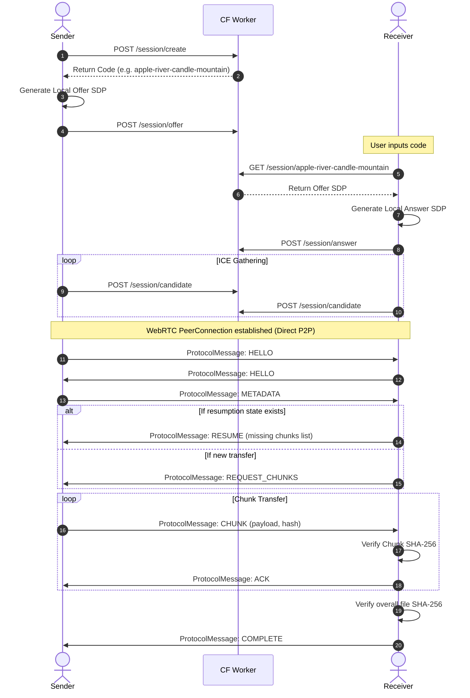

# WormSink P2P File Transfer Tool

WormSink is a production-quality Java 21 command-line application designed for transferring very large files (100GB+) directly between peers over the internet using WebRTC DataChannels, similar to Magic Wormhole. It is optimized for performance, low memory footprint, and recovery from connection dropouts.

---

## Key Features
*   **WebRTC Data Channels Only:** Direct peer-to-peer connection for high speeds, bypassing media servers.
*   **Lightweight Signaling:** Uses a Cloudflare Worker signaling service to exchange SDP offers/answers and ICE candidates.
*   **Interruption Recovery:** Saves transfer state after every successful chunk, enabling automatic resumption if a transfer stops.
*   **Adaptive Send Window:** Handles flow control and backpressure by checking data channel buffered amount before sending more.
*   **Low Memory Footprint:** Uses Java NIO and streaming architectures to prevent loading entire files into memory.

---

## Sequence Diagram

### Connection and Transfer Flow



---

## Getting Started

### 1. Extract Dictionary Words
Before building, run the test that parses the raw wordlist:
```bash
gradle :wormsink-core:test --tests "org.wormsink.core.DictionaryExtractor"
```

### 2. Build and Package
To build the CLI application:
```bash
gradle installDist
```

### 3. Deploy/Run the Signaling Server
To run the mock worker signaling server locally:
```bash
cd wormsink-worker-api
npx wrangler dev
```

### 4. Send a File
```bash
./wormsink-cli/build/install/wormsink-cli/bin/wormsink-cli send "/path/to/large-file.iso" --signaling-url="http://localhost:8787"
```

### 5. Receive a File
```bash
./wormsink-cli/build/install/wormsink-cli/bin/wormsink-cli receive <transfer-code> --signaling-url="http://localhost:8787" --output="/path/to/save-file.iso"
```
